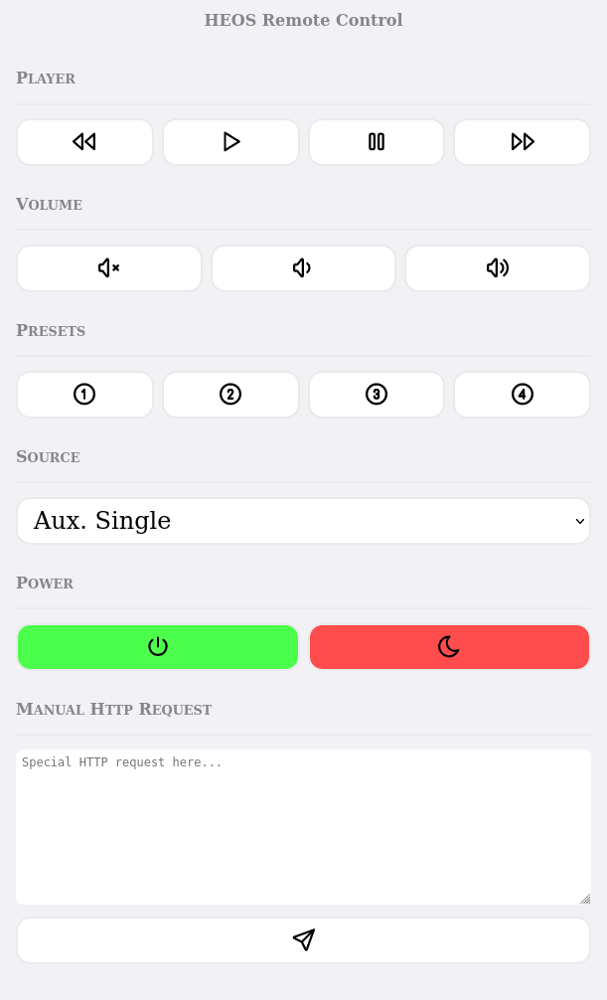
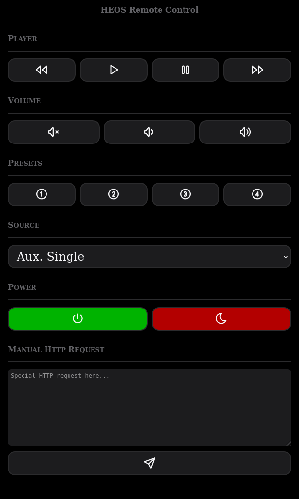

# HEOS (Denon) Audio/Video Amplifier Remote Control (Web UI)

This Heos Remote Control is a web UI allowing you to remotely
control your Denon AV amplifier on the same LAN through its telnet
interface.

This requires HEOS API server: https://github.com/open-denon-heos/heos-api-server
We will detail integration with HEOS API server in this document.

## Demo and Screenshots

You can try the UI at https://open-denon-heos.github.io/remote-control/public/ (not
connected to any back-end).

Screenshots:





## Quick start

See [run production image section](#run-remote-control-ui-and-server-production-image)

## Local Dev (without backend)

You can try this UI with (assuming you have [simple-http-server](https://github.com/TheWaWaR/simple-http-server) installed):

```sh
$ simple-http-server -i
```
Alternatively you can use

```sh
$ python3 -m http.server
```

And then head over to http://0.0.0.0:8000


##  Local DEV with Apache2 for HEOS API server integration

We will use Apache2 as a webserver to avoid;
- CORS issue
- Enable URL rewriting to easily redirect to proper API server


### Prerequisites: deploy API server

See https://github.com/open-denon-heos/heos-api-server#quick-start

```shell
mkdir -p ~/tmp
curl -o ~/tmp/PRD.docker-compose.yaml https://raw.githubusercontent.com/open-denon-heos/heos-api-server/main/PRD.docker-compose.yaml 
docker-compose -f ~/tmp/PRD.docker-compose.yaml pull 
docker-compose -f ~/tmp/PRD.docker-compose.yaml up
```

And then head over to http://localhost:5000, 

or find IP of your machine in LAN by doing

```shell
$ hostname -I
192.168.1.90 172.19.0.1 192.168.49.1 172.18.0.1 172.17.0.1 
```

And then head over for instance to http://192.168.1.90:5000

Here we documented how to deploy server on QNAP NAS: https://github.com/open-denon-heos/heos-api-server#run-on-qnap-nas

<!--
This prerequisite can also be filled by following [section](#run-remote-control-ui-and-server-production-image).
--> 

### Suggestion: define A record pointing to your machine/NAS

Example

````shell
$ nslookup local.nas.coulombel.net
Name:   local.nas.coulombel.net
Address: 192.168.1.88
````

### Deploy Apache 2 via Docker (recommended)

We will deploy Apache 2 using docker. We do not recommend to perform a [bare metal setup](./apache-setup/README.md).

Edit in [Apache config file](./apache-docker-config/heos.conf) `RewriteUrl` section lines (or add `Redirect` line instead) to target API server if needed.
If you deploy your API server and UI in same machine via Docker default setup will work.


#### Default setup explanation in Docker

<details>
  <summary>Click to expand!</summary>

When using redirect (gtm) the name resolution is done by client browser, routing from Client browser.
We saw this in [bare metal setup](./apache-setup/README.md#warning-on-ipfqdn-this-is-the-ipfqdn-which-is-targeted-by-client-browser-doing).
We perform a [redirection](./apache-setup/README.md#redirection).

Here when using RewriteRule (ltm, proxy), name resolution is done by Apache, routing from Apache.
We saw this in [bare metal setup](./apache-setup/README.md#we-should-use-rewriterule-in-heosconfheosconf).

<!-- 
Related to
private_script/tree/main/Links-mig-auto-cloud ==> GTM/LTM
and OpenShift route insecureEdgeTerminationPolicy -->

Objective target from UI docker, API server in Docker where both 2 Dockers are deployed on same machine.

If we had to use `Redirect` we would need to hardcode IP of server (even if deployed on same host as server).
If we use `RewriteUrl` when using Docker instead of bare metal we can not use localhost, as localhost is local to the container.

What are the options available to us?

- Pre-req:
  - https://docs.docker.com/network/
  - https://docs.docker.com/network/network-tutorial-standalone/
  - https://docs.docker.com/network/network-tutorial-host/
  - https://stackoverflow.com/questions/48546124/what-is-linux-equivalent-of-host-docker-internal
<!-- doc forked: https://github.com/scoulomb/docker.github.io -->

- Options:
  - We could use a `custom bridge network` in the 2 container with automatic service discovery: not possible as API server need to be on host network for UPNP discovery
  Also, if we can connect a container to several networks,  we can not connect container to a network of type `host` and `bridge` at the [same time](https://devops.stackexchange.com/questions/1410/connect-docker-container-to-both-host-and-internal-bridge-network)
  In [prerequsite](#prerequisites-deploy-api-server), note the compose file contains `host` network instruction.
  ````shell
  $ docker ps
  $ docker inspect tmp_server_1 -f "{{json .NetworkSettings.Networks.host.NetworkID }}"
  # a6cc193424114cc28bd8c27b66abed5a298c3e2fa6a5d1b8de7078c9642dca45
  $ docker network ls | grep a6cc19342411
  # a6cc19342411   host                     host      local
  ````

  - We could have API server AND UI docker container both on `host` network but in that case we would lose port forwarding capabilities (if using `-p` and `-net host`: Published ports are discarded when using host network mode) and would need to customize Apache setup virtual server to expose port 8000.
  Customization we had done for [bare metal setup](./apache-setup/README.md).
  - In [network-tutorial-standalone](https://docs.docker.com/network/network-tutorial-standalone/) they show how to use `Default bridge` network to communicate via IP: we can not use it as API is in host network.
  - We can use machine IP address: for ex: `192.169.1.90`, `local.nas.coulombel.net`, not convenient as not generic (as for `Redirect`)
  ```shell
  $ docker exec -it apache2-ui-heos /bin/bash
  root@507d23648bcc:/# curl 192.168.1.90:5000 # local IP on host
  ```
  - **However, Solution we can do is**:
    - API server Docker on Host network
    - Heos UI Docker in `default bridge` (or any `custom Bridge`) network
    - Use (default) bridge default gateway: `172.17.0.1`, routing to host machine, for which API server is accessible due to `Host` network
    - Thus `RewriteRule "^/heos-api-server/(.*)$" "http://172.17.0.1:5000/$1" [P,NC]`.

Note on compose when no network specified (custom bridge, host...) at all, Compose creates a `custom bridge network`: https://docs.docker.com/compose/networking/
> By default Compose sets up a single network for your app. Each container for a service joins the default network and is both reachable by other containers on that network, and discoverable by them at a hostname identical to the container name.

Compose default behavior override Docker default behavior (`default Bridge`).

</details>

#### Option 1: deploy using volume

Given that we use `RewriteUrl` feature (not enabled by default) <!-- unlike redirect -->, we will activate this feature and commit the image.

```shell
# clean and release port
sudo systemctl stop apache2 
docker kill apache2-ui-heos-tmp; docker rm apache2-ui-heos-tmp

# Run image and enable rewrite
docker run --name apache2-ui-heos-tmp ubuntu/apache2 
docker exec -it apache2-ui-heos-tmp /bin/bash
a2enmod rewrite proxy proxy_http
exit #very important to do exit; https://phoenixnap.com/kb/how-to-commit-changes-to-docker-image

# commit new image 
docker commit $(docker ps -a | grep apache2-ui-heos-tmp | awk '{print $1}')  ubuntu/apache2_rewrite

# clean
docker kill apache2-ui-heos-tmp
```

Launch server with volume mapping.

```shell
# clean and release port
sudo systemctl stop apache2 
docker kill apache2-ui-heos; docker rm apache2-ui-heos

# run server
docker run -v /home/scoulomb/heos/open-denon-heos/remote-control/public:/var/www/html \
           -v /home/scoulomb/heos/open-denon-heos/remote-control/apache-docker-config/heos.conf:/etc/apache2/sites-available/000-default.conf \
           -p 8000:80 --name apache2-ui-heos ubuntu/apache2_rewrite
           
docker exec -it apache2-ui-heos /bin/bash
```

<!-- we could have created intermediate image with proxy enabling -->

#### Option 2: build and deploy a specific docker image

````shell
docker build . -t ubuntu-apache
sudo systemctl stop apache2 
docker kill apache2-ui-heos; docker rm apache2-ui-heos
docker run -p 8000:80 --name apache2-ui-heos ubuntu-apache 
````

#### Option 3: build and deploy both server and UI via Compose 

#### Compose

See [docker compose](./localDev.docker-compose.yaml)


````shell
docker-compose -f localDev.docker-compose.yaml up --build
````


#### Network comment 

<details>
  <summary>Click to expand!</summary>

To come back to [network setup](#default-setup-explanation-in-docker)

If we check network setup, we have:

- server attached to `host` network (explict) 
- UI attached to `custom bridge network` (created by compose)
- Communication can be done via `http://172.17.0.1:5000/`

```shell
$ docker inspect remote-control_remote-control_1 -f "{{json .NetworkSettings.Networks }}" | jq | head -2
{
  "remote-control_default": {


$ docker inspect remote-control_server_1 -f "{{json .NetworkSettings.Networks }}" | jq | head -2
{
  "host": {

````

</details>

## Deliver production docker image 

````shell
docker build . -t scoulomb/heos-remote-control:1.0.0
docker login
docker push scoulomb/heos-remote-control:1.0.0
````

## Run remote control UI and server production image

### Run

See [docker compose](./PRD.docker-compose.yaml).


````shell
docker-compose -f PRD.docker-compose.yaml up
````
### Modify Apache configuration

<details>
  <summary>Click to expand!</summary>


When using delivered image and compose, you should not need to modify `RewriteUrl`, or `Redirect` in `/etc/apache2/sites-available/000-default.conf`.
But if needed you can edit [conf file](./apache-docker-config/heos.conf) and copy it to the remote-control docker image.


```shell
docker-compose -f PRD.docker-compose.yaml pull
docker-compose -f PRD.docker-compose.yaml images
docker cp apache-docker-config/heos.conf remote-control_remote-control_1:/etc/apache2/sites-available/000-default.conf 
```

You can also edit directly file: `/etc/apache2/sites-available/000-default.conf`.

````shell
docker exec -it remote-control_remote-control /bin/bash
apt-get update 
apt-get install vim 
service apache2 restart
docker-compose -f PRD.docker-compose.yaml restart
docker exec -it remote-control_remote-control_1 cat /etc/apache2/sites-available/000-default.conf
````

</details>

### Run on QNAP NAS

On QNAP NAS go to `Container station > create > create application`.
Copy [docker compose YAML file](PRD.docker-compose.yaml).

<!--
You may have to stop running container and clean images (if update and tag remains the same).
-->

Unfortunately QNAP NAS has a different default gateway, it is visible in `Network & Virtual Switch` panel after Compose deployment.

```shell
IP Address: 172.29.0.1
Virtual: heos_remote-cont..._Virtual Adapter 1
Member: Container Station
```
So we enter into container `/bin/bash` via UI.

```shell
apt-get update 
apt-get install curl
apt-get install vim
curl 172.17.0.1:5000 # KO
curl 172.29.0.1:5000 # OK
vim /etc/apache2/sites-available/000-default.conf # change 17 to 29
service apache2 restart
```

Restart container via QNAP UI.

<!-- If image was delivered with redirect and local.nas.coulombel.net I would not need to it, personally (initial setup)... -->

Note:
- UI entrypoint is `node:8000`.
- Back-end entrypoint is `node:5000`

<!-- in dev mode it can be convenient to `RewriteUrl`/`Redirect` from Apache dev to production API deployed on NAS -->

<!-- all above tested and worked properly - QA 28 jun with rewrite OK and QNAP, described both rewrite and redirect option in Apache bare metal and this README file, NO LOSS OK CLEAR -->

